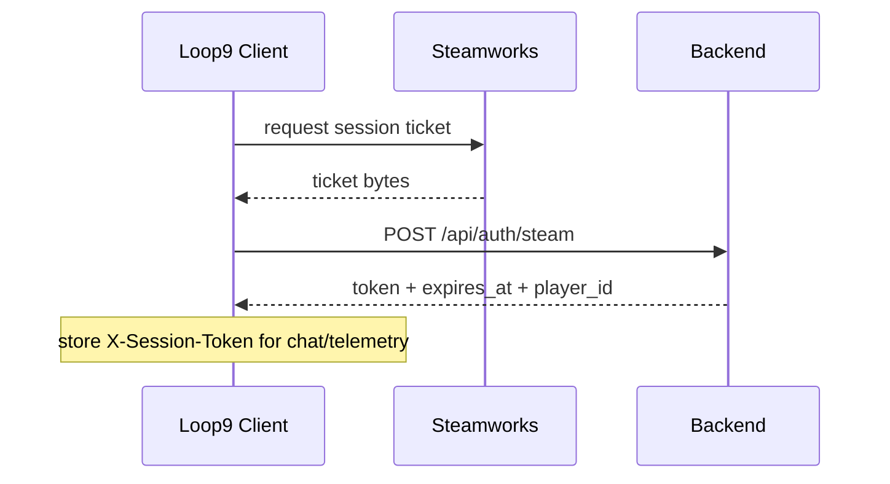

# AI and Backend Integration

Client systems:

- `ULoop9BackendAuthSubsystem` — Steam ticket exchange
- `ULoop9BackendChatService` — chat HTTP
- `ULoop9ObservationJournalSubsystem` — bounded, structured floor observations
- `AAI_Friend` / `UAI_ChatWidget` — phone UX + thinking indicator
- `ULoop9TelemetrySubsystem` — run-finished telemetry
- `Loop9BackendEndpointUtils` — derive auth/chat/telemetry URLs from `APIEndpoint`

Backend contracts: [`../../../Backend/Loop9_backend/docs/API.md`](../../../Backend/Loop9_backend/docs/API.md)

## Auth flow

Details:

- Auth HTTP timeout budget: **15 seconds**
- Production identity is derived from verified Steam ID (`steam-<id64>`)
- Legacy `X-Game-Token` is for non-production testing only (`bRequireSteamSession=false` client-side and `AUTH_ALLOW_GAME_TOKEN=true` backend non-prod)
- Failed/expired sessions should re-auth before chat continues

## Chat flow

1. Player sends a message in `UAI_ChatWidget`.
   - Pursuer floor: `AAI_Friend::SayToAI` stops here and shows the localized
     dead-line reply (`Loop9Chat/ChatPursuerNoAnswer`). Nothing is sent, no
     message slot, kindness delta or AI interaction is consumed.
2. `AAI_Friend` ensures a valid session token (queue/wait if auth pending).
3. Widget shows localized **Thinking...** and disables input.
4. After a long wait, status upgrades to **Still thinking...**
5. `ULoop9BackendChatService` POSTs to `/api/chat` with:
   - message, language, loop_index
   - relationship / stability fields
   - anomaly_context / anomaly_key / repeat_anomaly
   - anomaly_detail (zone + object kind), only when authored on the component
   - decoy_zone (one authored inactive place, when available)
   - advice_state (structured per-run commitment flags; never raw chat)
   - optional `observation_snapshot`: current authored zone, seconds on floor,
     at most 8 compact events, at most 8 visited zones, and fixed run counters
   - discrete kindness/suspicion state used by the backend
6. Client HTTP timeout: **65 seconds**
7. Backend AI cascade deadline: **45 seconds** (client timeout is intentionally larger)
8. Reply text is shown; `[STATE]KINDNESS` / `SUSPICION` / `DEPENDENCY` is parsed and applied to relationship stats
9. Optional response `advice` (`mode`, `lift`, `suggested_zone`, `commitment_id`) updates `FDragojloCommitmentState` when present
10. Thinking indicator is cleared; input re-enabled

### Observation snapshot boundary

The journal keeps at most 16 per-floor events and coalesces identical
type/zone/subject tuples with a saturating count. Projection is deterministic:
higher-priority events win, then newer events; no more than 8 are sent. If the
snapshot JSON would exceed 1024 UTF-8 bytes, low-priority/older projected
events are removed until it fits.

Only structured event enums and sanitized authored IDs are accepted. The
snapshot never contains chat text, coordinates, actor names, anomaly keys,
commitment IDs, or relationship floats. It is prompt context only and cannot
drive elevator correctness, relationships, achievements, endings, telemetry,
anomaly activation/selection, or advice policy.

Correlation:

- Client sends `X-Request-Id` when available
- Backend logs timing breakdowns with the same id

## Telemetry

`ULoop9TelemetrySubsystem::SendRunFinished` posts ending id, resets, and AI interaction counts to `/api/telemetry/run` with the session token when available.

Commitment balancing adds anonymous run aggregates: whether a wrong location
was offered and visited, seconds until that visit, whether the contradiction
was exposed, lift advice/follow counts, and whether a forced wrong-lift was
followed. It sends no coordinates, movement path, zone name, or chat text.

HTTP timeout: **15 seconds**. Backend stores nothing durable; it emits a structured log event.

## Error / UX expectations

| Situation | Player-facing expectation |
|---|---|
| Auth pending | Chat waits; no empty stuck state without thinking UI once request starts |
| Auth failure | Re-auth path; chat blocked until session is valid in shipping Steam mode |
| Moderation block | In-fiction safe fallback from backend (localized) |
| Provider timeout / outage | Fallback providers, then safe failure response |
| Network failure | Clear chat failure handling; thinking indicator must hide |
| Pursuer active | Local dead-line reply with anomaly mumble; no request, no thinking indicator |

## Configuration

- `Config/DefaultGame.ini` → `APIEndpoint`
- Never package production game tokens
- Confirm backend `/readyz` before release traffic

See also backend [AI Pipeline](../../../Backend/Loop9_backend/docs/AI_PIPELINE.md) and [Security & Privacy](../../../Backend/Loop9_backend/docs/SECURITY_AND_PRIVACY.md).
