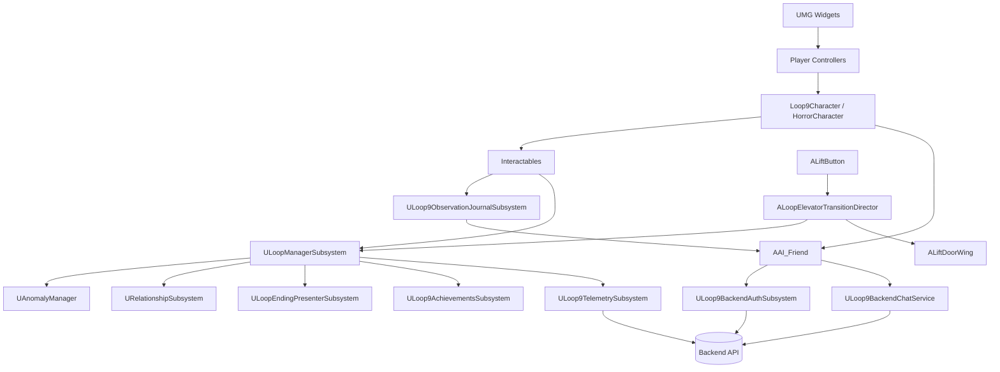

# Architecture

Loop 9 client architecture centers on **Game Instance subsystems** for durable run state and **world actors** for presentation. Gameplay decisions never depend solely on Sequencer Event Tracks.

Steam App ID: `4982260` · Engine: Unreal Engine **5.8** · Module: `Loop9`

## Layer overview

## Ownership boundaries

| Concern | Owner | Notes |
|---|---|---|
| Current loop, game finished, elevator decision IDs | `ULoopManagerSubsystem` | Game Instance |
| Per-run Dragojlo advice reduction | `FDragojloCommitmentTracker` | Pure reducer owned by LoopManager |
| Active anomaly registration / selection | `UAnomalyManager` | Game Instance |
| Trust / kindness / suspicion / dependency / AI stability | `URelationshipSubsystem` | Game Instance |
| Ending evaluation + sequence/widget presentation | `ULoopEndingPresenterSubsystem` | `FLoopEndingEvaluator` scores all six after a `< 3` chat Paranoid gate |
| Steam achievements | `ULoop9AchievementsSubsystem` | No-op without Steam |
| Steam session token for chat | `ULoop9BackendAuthSubsystem` | Ticket → `/api/auth/steam` |
| Chat HTTP | `ULoop9BackendChatService` | Static-safe response handling |
| Observation request encoding | `FLoop9ObservationCodec` | Wire names, JSON shape, 1024-byte budget |
| Bounded observation context + zone registry | `ULoop9ObservationJournalSubsystem` | Advisory Game Instance state; never gameplay authority |
| Elevator doors / fade / teleport timing / travel audio | `ALoopElevatorTransitionDirector` | World actor |
| Ending Level Sequences | `ALoop9GameMode::EndingSequences` | Soft refs; presenter plays them |
| Settings persistence | `ULoop9GameSettingsSubsystem` | `Game.ini` / user settings |

## Key modules under `Source/Loop9/`

| Area | Path |
|---|---|
| Loop types / ending enum | `Loop/LoopTypes.h`, `Loop/LoopEndingEvaluator.*` |
| Subsystems | `Subsystems/` |
| Anomaly components | `Anomaly/`, `Anomaly/Pursuer/` |
| Elevator / interaction | `Interaction/` |
| AI phone actor + chat UI | `AI_Friend.*`, `AI_ChatWidget.*`, `AI/Services/` |
| Characters / controllers | `Loop9Character.*`, `Characters/`, `Controllers/` |
| UI shell | `UI/` |
| Steam helpers | `Steam/` |

## Core runtime flow

1. Player explores the office and may talk to Dragojlo (`AAI_Friend`).
2. Player presses a lift button (`ALiftButton`).
3. If a `TransitionDirector` is bound, `ALoopElevatorTransitionDirector::BeginTransition` owns presentation.
4. Director asks `ULoopManagerSubsystem::ResolveElevatorDecision`, then later `CommitElevatorDecision` during the black/travel window.
5. Commit advances or resets the loop, updates relationships/achievements, and may defer ending presentation until doors reopen.
6. On loop ≥ 10 after a successful advance path, the run ends and `ULoopEndingPresenterSubsystem` plays an optional Level Sequence, then the ending widget, then returns to the main menu.
7. Telemetry and achievement unlocks fire from the ending/presenter path.

## Config & persistence surfaces

| Surface | Purpose |
|---|---|
| `Config/DefaultGame.ini` | Tracked production endpoint, packaged cultures/maps and inspection tuning |
| `Config/DefaultEngine.ini` | Tracked startup maps, Steam App ID, collision and rendering defaults |
| `Saved/Config/.../Game.ini` | Settings + achievement meta progress (`Loop9AchievementsSubsystem`) |
| Steam Cloud Auto-Cloud | Syncs selected `Saved/Config` files (see release checklist) |

## Game ↔ backend boundary

The client owns identity bootstrap and gameplay state. The backend owns auth verification, quotas, moderation, prompt assembly, and AI provider routing.

Documented in detail: [AI_AND_BACKEND_INTEGRATION.md](AI_AND_BACKEND_INTEGRATION.md) and backend [`ARCHITECTURE.md`](../../../Backend/Loop9_backend/ARCHITECTURE.md).

## Design constraints

- Prefer C++ for durable gameplay state; Blueprint for presentation and content wiring.
- Presentation locks (`IsGameplayPresentationLocked`) must block move, look, jump, sprint, interact, and pause.
- Idle actors should not tick; doors and transitions enable tick only while moving.
- Never put loop mutation, teleport, achievements, or input restore solely in a Sequencer Event Track.
- Observation snapshots are write-only gameplay context for chat. No gameplay
  decision, relationship, achievement, ending, telemetry, anomaly spawn, or
  advice policy may depend on journal contents.
