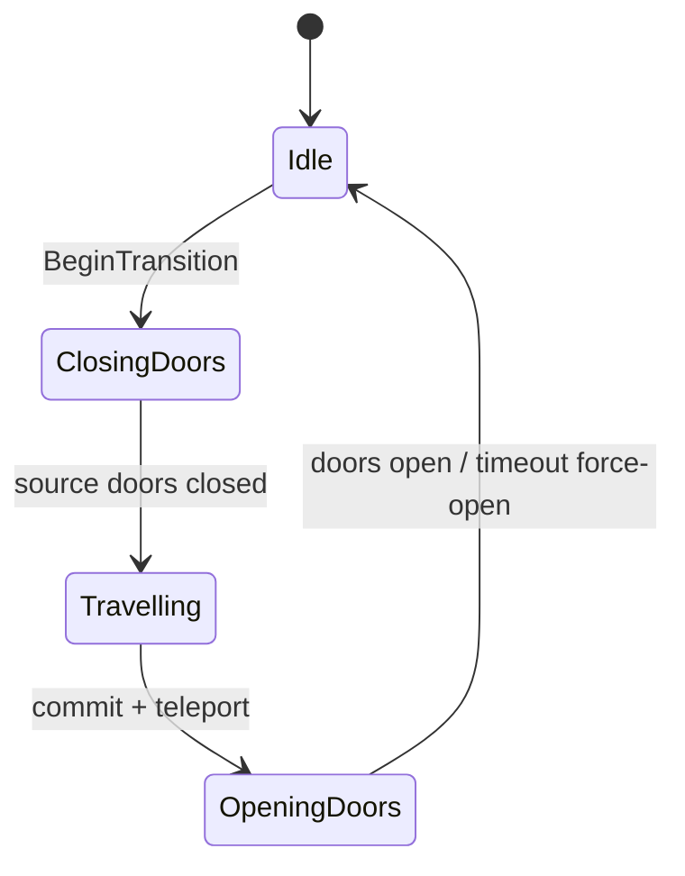

# Cinematics and Audio

## Current architecture (authoritative)

Elevator transitions are fully owned by C++ actor `ALoopElevatorTransitionDirector`.

Ending mini-cinematics still use Level Sequences played by `ULoopEndingPresenterSubsystem`.

## Elevator transition phases

Director responsibilities:

- lock player input and clear interaction prompts
- blend look toward the closing doorway
- play button-press sound immediately
- close source doors with timeout fallback
- start looping travel sound after doors close
- **one** fade-to-black (~1.0–1.5s), hold pure black across the hidden teleport, then a single fade-in
- clear any legacy blink-overlay animation invoked by older Blueprint events
- commit elevator decision and teleport to lit arrival
- open arrival doors with force-open timeout
- finish/cancel owned decision IDs safely on EndPlay
- complete or cancel deferred endings correctly

Do not add extra Camera Fade nodes in Blueprint `OnTravelStarted` / `OnArrivalStarted` events — that causes the triple-blink look.

### Audio hooks

| Property | When |
|---|---|
| `ButtonPressSound` | Transition start at the pressed button |
| `TravelSound` | After source doors close; stop/fade on arrival |
| `ButtonPressSoundVolume` / `TravelSoundVolume` | Gain |
| `TravelSoundFadeOutSeconds` | Arrival fade-out |

Set these on `BP_LoopElevatorTransitionDirector` (Details → Elevator Transition | Audio). No C++ rebuild needed after assigning assets — just save the Blueprint/map.

### Fade timing defaults

| Property | Default | Role |
|---|---|---|
| `FadeOutDurationSeconds` | 1.25 | Single fade to black when travel starts |
| `TravelDurationSeconds` | 2.5 | Total travel/blackout phase (clamped to at least fade-out) |
| `FadeInDurationSeconds` | 0.6 | Single fade-in after teleport |

## Ending sequences

Ending mini-cinematics prefer the C++ actor `ALoopEndingSceneDirector` when one
exists in the loaded map (same ownership model as the elevator director).

Fallback order in `ULoopEndingPresenterSubsystem`:

1. `ALoopEndingSceneDirector::PlayEnding` (camera / lights / cosmetic audio / text)
2. Soft-referenced Level Sequence on `ALoop9GameMode::EndingSequences`
3. Direct ending widget (no cinematic)

Place one `LoopEndingSceneDirector` (or BP child) in `FullOfficeMap` and assign:

| Property | Suggested actor |
|---|---|
| `Phone Actor` | `BP_AI_Friend` |
| `Chair Actor` | desk chair near Dragojlo (`SM_Chair_18` or closest) |
| `Arrival Viewpoint Actor` | `TP_LitElevatorArrival` |
| `Dimmable Light Actors` | up to 3 office `RectLight*` near the phone desk |
| `Footstep Sound` | `/Game/MyStuff/Sound/Footsteps/Footstep` |
| `Phone Ring Sound` | `/Game/MyStuff/Sound/Phone/PhoneRingingSound` |
| `Light Flicker Sound` | `/Game/MyStuff/Sound/MainMenu/light-flicker` |
| `Line Cut Sound` | optional; falls back to phone ring if empty |

Scene duration defaults to 5 seconds. Sequencer assets may remain mapped for
fallback, but the director is the release path.

Presenter behavior:

1. Evaluate ending type.
2. Prefer `ALoopEndingSceneDirector` (skip for Paranoid Survivor — glimpse plays while doors close).
3. Watchdog based on scene/sequence duration.
4. Fade, then show ending widget (Replacement skips the card and opens the green terminal first).
5. Replacement terminal ends on a blinking `You:_` prompt, holds ~2.5s, plays optional sound, then shows the ending card with Return to Main Menu.
6. Final-loop elevator travel stays black after source doors close — it does not reopen the lit cabin before the ending.

### Final-loop elevator note

When an advance would finish the run (`CurrentLoop` 9 → 10), `CommitAndArrive` detects the deferred ending and skips lit arrival / door reopen. Ending presentation starts from blackout after the cabin seals.

### Paranoid Survivor door-close

While source doors close on the ending advance, the elevator director looks left/right and optionally reveals `ParanoidGlimpseActor` (or spawns `ParanoidWalkerClass`) crossing the doorway in the last beat. Assign a walker mesh/actor on `BP_LoopElevatorTransitionDirector`.

### Obedient Fool audio

Only Obedient Fool starts the ambient phone ring during its mini-scene (`PhoneRingSound` on the ending director).

Release polish tasks remain tracked only in [`../RELEASE_CHECKLIST.md`](../RELEASE_CHECKLIST.md).
