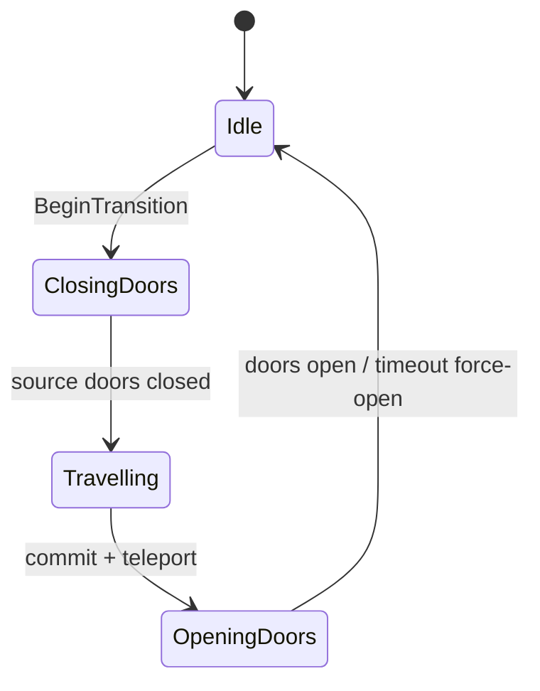

# Cinematics and Audio

## Current architecture (authoritative)

Elevator transitions are fully owned by C++ actor `ALoopElevatorTransitionDirector`.

Ending mini-cinematics still use Level Sequences played by `ULoopEndingPresenterSubsystem`.

## Elevator transition phases

Director responsibilities:

- lock player input and clear interaction prompts
- blend look toward the closing doorway
- play button-press sound immediately
- close source doors with timeout fallback
- start looping travel sound after doors close
- **one** fade-to-black (~1.0–1.5s), hold pure black across the hidden teleport, then a single fade-in
- clear any legacy blink-overlay animation invoked by older Blueprint events
- commit elevator decision and teleport to lit arrival
- open arrival doors with force-open timeout
- finish/cancel owned decision IDs safely on EndPlay
- complete or cancel deferred endings correctly

Do not add extra Camera Fade nodes in Blueprint `OnTravelStarted` / `OnArrivalStarted` events — that causes the triple-blink look.

### Audio hooks

| Property | When |
|---|---|
| `ButtonPressSound` | Transition start at the pressed button |
| `TravelSound` | After source doors close; stop/fade on arrival |
| `ButtonPressSoundVolume` / `TravelSoundVolume` | Gain |
| `TravelSoundFadeOutSeconds` | Arrival fade-out |

Set these on `BP_LoopElevatorTransitionDirector` (Details → Elevator Transition | Audio). No C++ rebuild needed after assigning assets — just save the Blueprint/map.

### Fade timing defaults

| Property | Default | Role |
|---|---|---|
| `FadeOutDurationSeconds` | 1.25 | Single fade to black when travel starts |
| `TravelDurationSeconds` | 2.5 | Total travel/blackout phase (clamped to at least fade-out) |
| `FadeInDurationSeconds` | 0.6 | Single fade-in after teleport |

## Ending sequences

Six Level Sequences are supported via `ALoop9GameMode::EndingSequences`.

Presenter behavior:

1. Evaluate ending type.
2. Optionally play the mapped Level Sequence.
3. Watchdog based on sequence duration (no artificial 120s hard truncate).
4. Fade, cleanup sequence actor, show ending widget.
5. Replacement ending may route through a terminal widget.
6. Return to main menu on a timer after acknowledgement / failure fallback.

Sequencer should only drive camera, lights, props, and cosmetic audio. It must not own:

- loop mutation
- teleport
- achievements
- save/load
- input restore

## Editor QA checklist

- Lit and dark elevator buttons both complete without soft-lock.
- Abandoned / interrupted transitions restore input.
- Travel sound stops on arrival and on abort.
- Each ending sequence reaches its widget.
- Missing sequence asset still shows the ending widget.
- Deprecated `LS_Elevator_Lit` / `LS_Elevator_Dark` are unreferenced before deletion.

Release polish tasks remain tracked only in [`../RELEASE_CHECKLIST.md`](../RELEASE_CHECKLIST.md).
